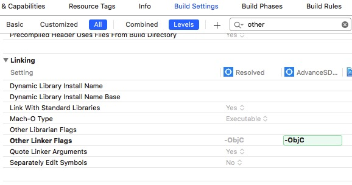

# AdvanceSDK

[](https://cocoapods.org/pods/AdvanceSDK)
[](https://cocoapods.org/pods/AdvanceSDK)
[](https://cocoapods.org/pods/AdvanceSDK)

# AdvanceSDK对接文档-IOS


本文档为AdvanceSDK接入配置参考文档。用户可以参考Example工程中的配置以及广告位接入代码进行开发。

目前聚合SDK聚合的SDK有：Mercury，广点通，穿山甲，请在对接的时候使用支持相应sdk管理的AdvanceSDK。

目前AdvanceSDK支持统一管理的广告位类型为：

- [开屏广告位(Splash)](./_docs/ads/splash_ad.md)
- [横幅广告位(Banner)](./_docs/ads/banner_ad.md)
- [插屏广告位（Interstitial)](./_docs/ads/Interstitial_ad.md)
- [激励视频(RewardVideo)](./_docs/ads/reward_video_ad.md)
- [原生模板信息流广告位(NativeExpress)](./_docs/ads/native_express_ad.md)
- [全屏视频视频(FullScreenVideo)](./_docs/ads/full_screen_ad.md)

> 如开发者已经集成过渠道SDK，不想再次开发，或需要管理其他类型广告位，可参考[自定义开](./_docs/ads/custom_ad.md)发纳入AdvanceSDK管理

## SDK项目部署

自动部署可以省去您工程配置的时间。iOS SDK会通过CocoaPods进行发布，推荐您使用自动部署。

#### Step 1 安装CocoaPods

CocoaPods是Swift和Objective-C Cocoa项目的依赖项管理器。它拥有超过7.1万个库，并在超过300万个应用程序中使用。CocoaPods可以帮助您优雅地扩展项目。如果您未安装过cocoaPods，可以通过以下命令行进行安装。更多详情请访问CocoaPods官网。

```
$ sudo gem install cocoapods
```
注意：安装过程可能会耗时比较长，也有可能收到网络状况导致失败，请多次尝试直到安装成功。

#### Step 2 配置Podfile文件

```
$ pod init
```

打开Podfile文件，应该是如下内容（具体内容可能会有一些出入）：

```
# platform :ios, '9.0'
target '你的项目名称' do
  # use_frameworks!
  # Pods for 你的项目名称
end
```

修改Podfile文件，将pod 'AdvanceSDK'添加到Podfile中，如下所示：

```
platform :ios, '9.0'
target '你的项目名称' do
  # use_frameworks!
  # Pods for 你的项目名称
  pod 'AdvanceSDK', '~> 3.2.0' # 可指定你想要的版本号
  pod 'AdvanceSDK/CSJ', 	# 如果需要导入穿山甲SDK
  pod 'AdvanceSDK/GDT', 	# 如果需要导入广点通SDK
  pod 'AdvanceSDK/Mercury' # 如果需要导入MercurySDK
end
```

#### Step 3 使用CocoaPods进行SDK部署
通过CocoaPods安装SDK前，确保CocoaPods索引已经更新。可以通过运行以下命令来更新索引：

```
$ pod repo update
```
运行命令进行安装：
```
$ pod install
```
也可以将上述两条命令合成为如下命令:
```
$ pod install --repo-update
```

命令执行成功后，会生成.xcworkspace文件，可以打开.xcworkspace来启动工程。

#### Step 4 升级SDK

升级SDK时，首先要更新repo库，执行命令：
```
$ pod repo update
```
之后重新执行如下命令进行安装即可升级至最新版SDK

```
$ pod install
```
* 注意 ：只有在Podfile文件中没有指定SDK版本时，运行上述命令才会自动升级到最新版本。不然需要修改Podfile文件，手动指定SDK版本为最新版本。


#### Step 5 指定SDK版本

指定SDK版本前，请先确保repo库为最新版本，参考上一小节内容进行更新。如果需要指定SDK版本，需要在Podfile文件中，pod那一行指定版本号：

```
  pod 'AdvanceSDK', '~> 3.2.0' # 可指定你想要的版本号
  pod 'AdvanceSDK/CSJ', '~> 3.2.0'	# 如果需要导入穿山甲SDK
  pod 'AdvanceSDK/GDT', '~> 3.2.0'	# 如果需要导入广点通SDK

```
之后运行命令：

```
$ pod install

```

> 注意: 如导入穿山甲SDK出现`_OBJC_CLASS_$_XXXX`提示，可尝试以下方案:

使用Git LFS安装

[Git LFS](https://git-lfs.github.com/) 是用于使用Git管理大型文件的命令行扩展和规范。您可以按照以下步骤安装它：

步骤 1: 点击并下载 [Git LFS](https://git-lfs.github.com/) 

步骤 2: 使用以下命令安装LFS：

```
sudo sh install.sh
```
步骤 3: 检查安装是否正确：

```
git lfs version
```
步骤 4: 再次执行`pod install `

如还有问题的话，有可能是 Cocoapods 的缓存，执行这个命令`rm -rf ~/Library/Caches/CocoaPods`，重新 pod install 就可以了。

#### Step 6 网络配置（必须)

苹果公司在iOS9中升级了应用网络通信安全策略，默认推荐开发者使用HTTPS协议来进行网络通信，并限制HTTP协议的请求，sdk需要app支持http请求：


#### Step 7 链接设置(必须)

在Target->Build Settings -> Other Linker Flags中添加-ObjC, 字母o和c大写。



## 接入代码

您可以运行自带的Example工程，参考Example工程中的接入代码进行开发。

### 全局初始化设置

聚合SDK要正确工作需要各个SDK在app启动时正确初始化，具体各个SDK的设置方式不尽相同，请参考各个SDK的文档。


## 验收测试

代码对接完成后请提供测试包给我方对接测试人员进行验收。
